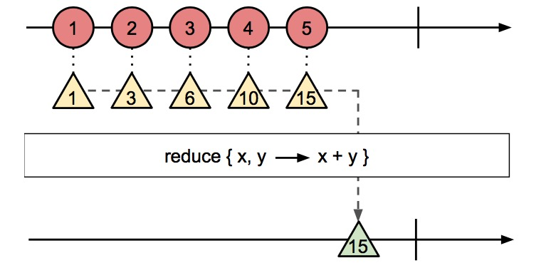
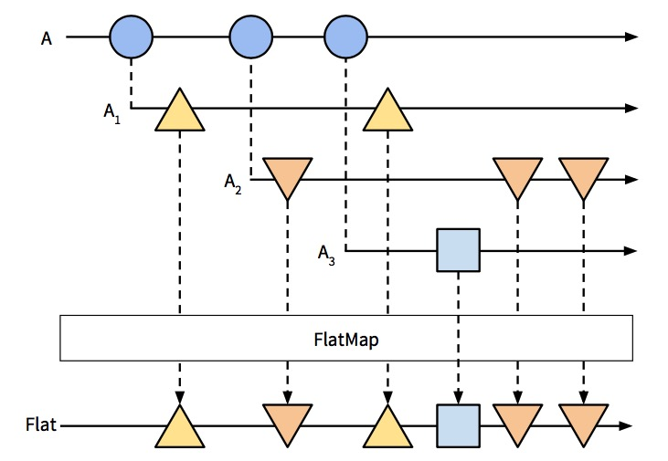

# 第二章 深入队列

我记得小时候曾经玩过一个游戏，你必须通过各种技巧引导水流通过屏幕。你可以让流水分叉然后在将它们合并，或者用一块倾斜的木板改变它们的方向。
要取得胜利你必须发挥自己的创造性。

我认为使用 Observable 队列和玩这个游戏之间其实是有很多相似之处的。Observables 就是一些*事件流*，我们可以对其进行转化，合并，查询等
操作。不管我是在处理简单的ajax回调，还是node.js的数据流（processing gigabytes of data），我们声明*流*的方式都是相同的。
一旦我们接受了*流*的设定，我们程序的复杂性也就随之降低了。

在这一章中我们将讨论如果在程序中高效的使用队列。目前为止我们已经讲过如何创建 Observable 并且在其上执行一些间的操作。为了从分发挥其能力，
我们必须把程序的输入和输出转换成队列来模拟我们的程序流。

开始之前，我们将先认识一些基础的操作符，它们将帮助我们开始操作队列。然后我们将实现一个能过实时（几乎是）展现地震发生情况的应用。让我们开始
吧。

## 可视化 Observables 

你将学习到一些我们在 RxJS 程序中最经常使用到的操作符。直接讨论操作符对队列能做些什么是很抽象的。为了帮助开发者更容易理解操作符，我们为队列
使用一种标准可视化展现方式，叫做 *marble diagrams*。它们用于异步数据流的可视化呈现，你会在每个 RxJS 的相关资源中找到它们。

我们来说说 `range` 操作符，它返回一个能够在特定范围内生成整数的 Observable：`Rx.Observable.range(1, 3);`

它的Marble图则是这样的：


如图，长箭头标识 Observable，x轴表示时间。每一个圆圈表示 Observable 内部调用 `onNext()` 生成的整数值。在生成了第三个值以后，`range`
调用 `onCompleted`，在图上表示为一条竖线。

我们来看下需要多个 Observable 的情况。`merge` 操作符传入两个不同的 Observable 返回一个新的合并过的值。`interval`操作符返回一个以毫秒
计算的周期性生成递增数值的 Obsevable。

在下面的代码中我们合并了两个使用 `interval` 操作符以不同周期生成值的 Observable：
```javascript
var a = Rx.Observable.interval(200).map(function(i) { 
  return 'A' + i;
});

var b = Rx.Observable.interval(100).map(function(i) {
  return 'B' + i; 
});

Rx.Observable.merge(a, b).subscribe(function(x) { 
  console.log(x);
});
```
> B0, A0, B1, B2, A1, B3, B4...

`merge` 操作符的 marble 图如下所示：


这里，沿y轴的虚线箭头指向了作用在队列A B中每个元素上的转化的最终结果。生成后的 Observable 表示为 C，其中包含了 A B 中合并后的元素。如果
不同 Observable 的元素在同一时间生成出来的话，则它们在合并后的队列中的顺序是随机的。

## 基础队列操作符

在RxJS中有很多有用于转换Observable的操作符，最常用的还是那些任何提供了正式集合处理能力的编程语言都包含的方法:`map`、`filter` 和 `reduce`。
在 JavaScript 中你能在数值对象上找到这些个方法。

RxJS 遵循了 JavaScript 的惯例，所以你会发现下面说的操作符的语法几乎和数值方法一样。事实上，我们会展示用数组和Observable的两种实现方法，你会
看到它们是如此相似。

### Map

map 是最常用到的队列转化操作符。它接收一个Observable和一个函数，然后在源Observable中的每个元素上应用这个函数，最后返回一个新的包含转换之后
值的 Observable。


```javascript
// js array
var src = [1, 2, 3, 4, 5];
var upper = src.map(function(name) {
  return name * 2; 
});
upper.forEach(logValue);
```
```javascript
// Observables
var src = Rx.Observable.range(1, 5); 
var upper = src.map(function(name) {
  return name * 2; 
});
upper.subscribe(logValue);
```

在两种情况下， `src` 都没有改变。

这段代码还有下面的代码，都使用的 `logValue` 函数：

```javascript
var logValue = function(val) { console.log(val) };
```

我们可以用其他函数替换传入 `map` 的 `logValue` 函数来做一些异步计算去转换Observable的值。但那样的话，`map` 并不会像我们预期的那样工作。
更好的方式是使用22页提到的 `flatMap`。

### Filter

`filter` 接收一个Observable和一个判断函数，然后用这个函数测试Observable中的每一个值。最后返回一个包含了所有测试结果为true的元素的Observable
队列。


```javascript
var isEven = (function(val) { return val % 2 !== 0; });
```

```javascript
// js array
var src = [1, 2, 3, 4, 5];
var even = src.filter(isEven);

even.forEach(logValue);
```
```javascript
// Observables
var src = Rx.Observable.range(1, 5);
var even = src.filter(isEven);

even.subscribe(logValue);
```

### Reduce

`reduce`(也被称作 *folder*) 接收一个Observable，然后返回一个只包含一个元素的新的Observable，这个元素是在源Observable的各个元素上
应用同一个函数的结果。该函数接收一个当前元素与一个自己上轮调用的结果作为该轮调用的参数。



```javascript
// js array
var src = [1, 2, 3, 4, 5];
var sum = src.reduce(function(a, b) { 
  return a + b;
});

console.log(sum);
```

```javascript
// Observables
var src = Rx.Observable.range(1, 5); 
var sum = src.reduce(function(acc, x) {
  return acc + x; 
});

sum.subscribe(logValue);
```
`reduce`是个强大的操作队列的操作符。事实上，它也是整个被称作*聚合操作符（aggregate operators）*子集的实现基础。

### Aggregate Operators

聚合操作符（aggregate operators）处理一个队列然后返回一个值 `Rx.Observable.first` 接收一个 Observable 和一个可选的断言函数，
然后返回Observable中满足该断言的第一个元素。

计算队列元素的平均值也是一种聚合操作，RxJS提供了这种操作符`average`，但是由于这部份讲 reduce的原因，我们想看看如何用`reduce`来实现它。
每一个聚合操作符都能过只用`reduce`来实现。

```javascript
var avg = Rx.Observable.range(0, 5).reduce(function(prev, cur) {
  return {
    sum: prev.sum + cur, 
    count: prev.count + 1
  };
}, { sum: 0, count: 0 })
.map(function(o) {
  return o.sum / o.count; 
});

var subscription = avg.subscribe(function(x) { 
  console.log('Average is: ', x);
});
```
> Average is: 2

在这段代码中我们使用 `reduce` 来把每一个新的值加到前一个上面。由于reduce没有提供队列中元素总数，我们需要额外记录它们的数量。我们调用
`reduce`的时候给了一个初始化的值，它是一个由sum和count两个字段组成的对象，我们可以用来存储当前元素的总和与数量。每一个元素都会返回更
新后的对象。

当队列结束，`reduce` 将会使用最终的总和与最总数量来调用`onNext`方法。这事我们可以使用`map`来返回两者想出的结果，即为平均数。

> Joe Asks:   
> ### 可以聚合无限Observable吗？   
> 假设我们正在写一个程序来显示用户步行时的平均速度。即使用户还没用停止步行，我们也需要根据目前为止的数据计算平均值。我们想要实时记录一个
无限队列的当前平均值。问题是如果队列还没结束，像`reduce`这样的聚合操作符就不会去调用Observable的`onNext`方法。   
> 幸好，RxJS团队已经考虑到这种情况从而为我们提供了`scan`操作符，它和`reduce`一样但可以生成中间的结果。   

```javascript
var avg = Rx.Observable.interval(1000).scan(function (prev, cur) {
  return {
    sum: prev.sum + cur, 
    count: prev.count + 1
  };
}, { sum: 0, count: 0 }) 
.map(function(o) {
  return o.sum / o.count;
});

var subscription = avg.subscribe( function (x) { 
  console.log(x);
});
```
> 这样我们就可以聚合需要很长时间才能完成的或者无限队列。在上面的例子中我们每秒生成一个递增的数值并且用`scan`替换了之前的`reduce`。
现在我们就可以每秒获得当前生成的所有值的平均数了。

### flatMap

那么，如果一个Observable执行的结果是更多的其他的Observable该怎么办呢？一般来说，你会想要把所有嵌套Observable中的元素都统一到
一个单独的队列中去。而`flatMap`就是干这事儿的。

`flatMap` 接收一个其中所有元素也都是Observable的Observable A，然后返回一个结果是A中的子Observable ‘压平’ 后的元素的新的Observable
。我们通过可视化图形来一看究竟。



我们可以看到A中的每一个元素(A1,A2,A3)也都是Observable队列。当我们用一个转换函数对A执行`flatMap`操作时，我们就的到了一个新的Observable，
其元素是原来A中的不同子Observable所有元素的集合。

`flatMap`是一个强大的操作符，与此同时它也比我们至今学过的所有操作符更加难以理解。可以把它想成Observable的 `concatAll()`。

`concatAll` 是这样一个函数，它接收一个二维数组，然后返回一个一维数组，其中的元素是将原本所有子数组压平后的元素的集合而非子数组本身。
我们可以用`reduce`来实现这样一个函数。

```javascript
function concatAll(source) {
  return source.reduce(function(a, b) {
    return a.concat(b); 
  });
}

concatAll([[0, 1, 2], [3, 4, 5], [6, 7, 8]]);
```
> [0, 1, 2, 3, 4, 5, 6, 7, 8]

`flatMap` 做了同样的事情，但是处理的是Observables而非数组。它接收一个源Observable和返回新Observable的一个函数，然后在源Observable
的每一个元素上应用这个函数，就像`map`一样。如果事情就此打住，我们最终得到了一个可以生成Observable的Observable。但是 `flatMap`还会向
主队列中‘生成’由各个新的Observable生成的值，把所有Observable压平到一个主队列中去。最终，我们得到了一个单独的Observable。

