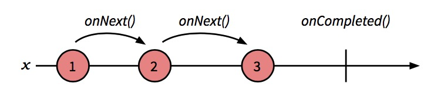
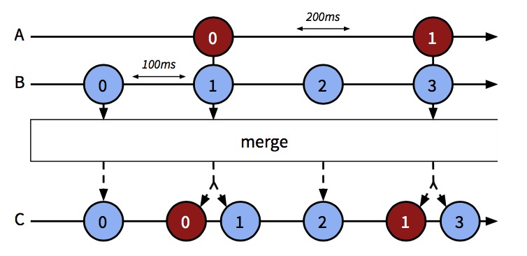
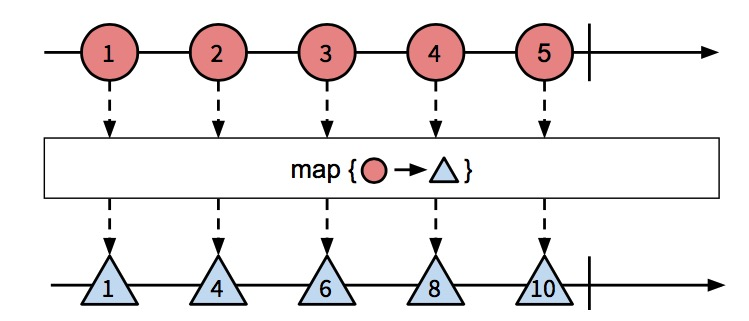
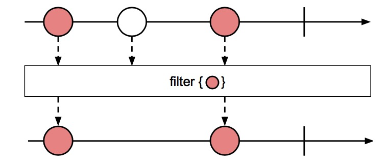

# 第二章 深入队列

我记得小时候曾经玩过一个游戏，你必须通过各种技巧引导水流通过屏幕。你可以让流水分叉然后在将它们合并，或者用一块倾斜的木板改变它们的方向。
要取得胜利你必须发挥自己的创造性。

我认为使用 Observable 队列和玩这个游戏之间其实是有很多相似之处的。Observables 就是一些*事件流*，我们可以对其进行转化，合并，查询等
操作。不管我是在处理简单的ajax回调，还是node.js的数据流（processing gigabytes of data），我们声明*流*的方式都是相同的。一旦我们
接受了*流*的设定，我们程序的复杂性也就随之降低了。

在这一章中我们将讨论如果在程序中高效的使用队列。目前为止我们已经讲过如何创建 Observable 并且在其上执行一些间的操作。为了从分发挥其能力，
我们必须把程序的输入和输出转换成队列来模拟我们的程序流。

开始之前，我们将先认识一些基础的操作符，它们将帮助我们开始操作队列。然后我们将实现一个能过实时（几乎是）展现地震发生情况的应用。让我们开始
吧。

## 可视化 Observables 

你将学习到一些我们在 RxJS 程序中最经常使用到的操作符。直接讨论操作符对队列能做些什么是很抽象的。为了帮助开发者更容易理解操作符，我们为队列
使用一种标准可视化展现方式，叫做 *marble diagrams*。它们用于异步数据流的可视化呈现，你会在每个 RxJS 的相关资源中找到它们。

我们来说说 `range` 操作符，它返回一个能够在特定范围内生成整数的 Observable：`Rx.Observable.range(1, 3);`

它的Marble图则是这样的：



如图，长箭头标识 Observable，x轴表示时间。每一个圆圈表示 Observable 内部调用 `onNext()` 生成的整数值。在生成了第三个值以后，`range`
调用 `onCompleted`，在图上表示为一条竖线。

我们来看下需要多个 Observable 的情况。`merge` 操作符传入两个不同的 Observable 返回一个新的合并过的值。`interval`操作符返回一个以毫秒
计算的周期性生成递增数值的 Obsevable。

在下面的代码中我们合并了两个使用 `interval` 操作符以不同周期生成值的 Observable：
```javascript
var a = Rx.Observable.interval(200).map(function(i) { 
  return 'A' + i;
});

var b = Rx.Observable.interval(100).map(function(i) {
  return 'B' + i; 
});

Rx.Observable.merge(a, b).subscribe(function(x) { 
  console.log(x);
});
```
> B0, A0, B1, B2, A1, B3, B4...

`merge` 操作符的 marble 图如下所示：



这里，沿y轴的虚线箭头指向了作用在队列A B中每个元素上的转化的最终结果。生成后的 Observable 表示为 C，其中包含了 A B 中合并后的元素。如果
不同 Observable 的元素在同一时间生成出来的话，则它们在合并后的队列中的顺序是随机的。

## 基础队列操作符

在RxJS中有很多有用于转换Observable的操作符，最常用的还是那些任何提供了正式集合处理能力的编程语言都包含的方法:`map`、`filter` 和 `reduce`。
在 JavaScript 中你能在数值对象上找到这些个方法。

RxJS 遵循了 JavaScript 的惯例，所以你会发现下面说的操作符的语法几乎和数值方法一样。事实上，我们会展示用数组和Observable的两种实现方法，你会
看到它们是如此相似。

### Map

map 是最常用到的队列转化操作符。它接收一个Observable和一个函数，然后在源Observable中的每个元素上应用这个函数，最后返回一个新的包含转换之后
值的 Observable。



```javascript
// js array
var src = [1, 2, 3, 4, 5];
var upper = src.map(function(name) {
  return name * 2; 
});
upper.forEach(logValue);
```
```javascript
// Observables
var src = Rx.Observable.range(1, 5); 
var upper = src.map(function(name) {
  return name * 2; 
});
upper.subscribe(logValue);
```

在两种情况下， `src` 都没有改变。

这段代码还有下面的代码，都使用的 `logValue` 函数：

```javascript
var logValue = function(val) { console.log(val) };
```

我们可以用其他函数替换传入 `map` 的 `logValue` 函数来做一些异步计算去转换Observable的值。但那样的话，`map` 并不会像我们预期的那样工作。
更好的方式是使用22页提到的 `flatMap`。

### Filter

`filter` 接收一个Observable和一个判断函数，然后用这个函数测试Observable中的每一个值。最后返回一个包含了所有测试结果为true的元素的Observable
队列。



```javascript
var isEven = (function(val) { return val % 2 !== 0; });
```

```javascript
// js array
var src = [1, 2, 3, 4, 5];
var even = src.filter(isEven);

even.forEach(logValue);
```
```javascript
// Observables
var src = Rx.Observable.range(1, 5);
var even = src.filter(isEven);

even.subscribe(logValue);
```

### Reduce
